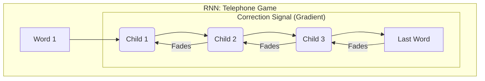
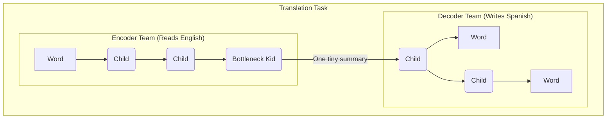
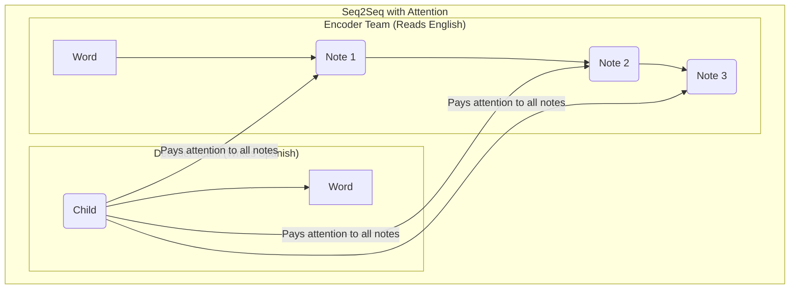
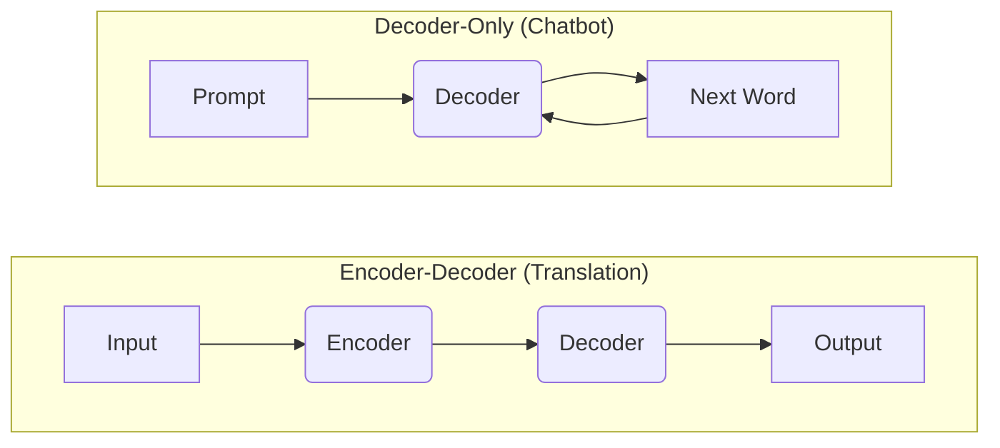
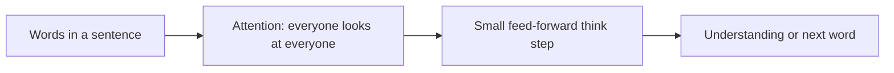

# Attention Is All You Need: The ELI5 Version

This document provides a simplified, "Explain Like I'm 5" (ELI5) overview of the concepts behind the "Attention Is All You Need" paper, which introduced the Transformer architecture. It's designed for anyone new to the topic, using analogies to make complex ideas easier to grasp.

This content is adapted from a more detailed learning document.

---

# ELI5: "Attention Is All You Need" & The Transformer

- Think of a sentence like a classroom of kids. Each kid (word) can look at any other kid to figure out who matters for answering a question. That looking-around trick is called **"attention."**

- A **Transformer** is just a bunch of layers where every kid looks at every other kid (attention), then they each do a little bit of thinking (a feed-forward step). Stack lots of these layers, and you get a smart team that can understand and generate language.

### Why was this a big deal?

- **Older models read one word at a time.** This is slow, like reading a book word by word in a long line.
- **Transformers let every word look at every other word at once.** This is much faster on modern computers (like GPUs) and made today's huge, powerful language models possible.

---

## The Journey to the Transformer: A "Telephone Game" Analogy

To understand why Transformers were such a breakthrough, let's see what came before them.

### The Old Way: Recurrent Neural Networks (RNNs)

Imagine an RNN is like a game of "Telephone."

- Each child is a "step" in processing a sentence (one word at a time).
- The first child whispers a word to the second, who whispers it to the third, and so on.
- **The Problem (Vanishing Gradient):** If the last child says the wrong word, a correction has to be passed all the way back to the first child. With each pass backward, the correction gets weaker and weaker. By the time it reaches the first child, it's too tiny to be useful. This means the model struggles to remember things from the beginning of a long sentence.

### A Smarter Way: LSTMs (Long Short-Term Memory)

LSTMs are a special version of the "Telephone" game where each child has a "super smart brain" with three filters, or "gates":

1.  **Forget Gate:** "Is this old part of the message no longer important? I can forget it."
2.  **Keep Gate:** "Is this new piece of the message really important to remember for later?"
3.  **Update Gate:** "Should I update my memory with this new information?"

Because these children are smart about what to remember and what to forget, important information can travel much further down the line. This helps LSTMs understand connections between words that are far apart in a sentence.

### The Problem with Translating (The "Bottleneck Kid")

Even with LSTMs, there was a problem in tasks like translation. Imagine two teams of kids:

1.  **The Encoder Team:** Reads a sentence in English, word by word.
2.  **The "Bottleneck Kid":** The last kid on the Encoder team. Their job is to summarize the _entire_ English sentence into **one, tiny, fixed-size message**.
3.  **The Decoder Team:** Gets only that one tiny summary and tries to build the translated sentence in Spanish from it.

**The Big Problem:** The summary is too small! You can't describe a whole movie with just one emoji. Important details get lost, especially in long sentences.

### A Better Idea: Adding "Attention"

The next big idea was to say, "Why does the Decoder team only get one tiny summary? Why can't they look at all the notes the Encoder team made along the way?"

This is **Seq2Seq with Attention**:

- The Encoder team still reads the English sentence, but now every child writes down their own notes.
- When a child on the Decoder team is about to say the next Spanish word, they can shout back to the _entire_ Encoder team, "Hey! I'm trying to translate 'apple' now. Which of you should I pay the most attention to?"
- The Encoder children who handled the word "apple" shout back, "Pay attention to my note!"

This allows the Decoder to focus its attention on the most relevant parts of the original sentence, making translations much better.

---

# The Transformer: "Attention Is All You Need"

The final breakthrough was the Transformer, which threw out the slow, one-by-one telephone line entirely.

### How Transformers Work

- **No More Line of Children:** There's no more sequential processing.
- **Everyone Reads at Once!** Imagine a team of "smart readers." When you give them a book, all of them look at the entire book at the same time. This is called **parallel processing**.
- **Super-Powered "Self-Attention":** Each "smart reader" (word) is constantly checking every other word in the book to see how it connects. They ask, "How does my word 'bank' relate to the word 'river' or 'money' somewhere else in the sentence?"

### Why this was a HUGE deal:

1.  **Faster:** This "all-at-once" reading made training on gigantic amounts of data much quicker.
2.  **More Accurate:** It also made the AI's understanding of language better.
3.  **Foundation for Modern AI:** This new architecture became the blueprint for almost all the powerful AI we see today, like **BERT** (which is great at understanding text) and **GPT** (which is great at generating text, like ChatGPT).

---

## Modern AI Models: Different Flavors of Transformers

The original Transformer had two parts (an Encoder to read and a Decoder to write). Modern models often use just one part.

### 1. Encoder-Only Models (e.g., BERT)

- **What it is:** A powerful brain that is only good at **understanding** text. It reads a whole sentence at once to figure out the context and meaning.
- **What it's good for:** Classifying text (spam or not?), answering questions from a paragraph, and finding specific info.

### 2. Decoder-Only Models (e.g., GPT)

- **What it is:** A powerful brain that is only good at **writing** text, one word at a time. It takes a prompt and predicts the next most likely word, then the next, and so on.
- **How it works:**
  1.  It has already been trained on a massive amount of text from the internet, so it has a deep "knowledge" of how language works.
  2.  Your prompt becomes the starting point.
  3.  It uses its knowledge to predict the next word.
  4.  It adds that new word to the sequence and predicts the next one, building the response word by word.
- **What it's good for:** Writing stories, having conversations (like ChatGPT), and completing sentences.

That's it! Transformers use a powerful "attention" mechanism to process language in a faster and more effective way, which is why they are the foundation of modern AI.

## Refernces

1. [Attention is all you need](https://arxiv.org/abs/1706.03762)
2. [Transformers Explained: The Discovery That Changed AI Forever](https://www.youtube.com/watch?v=JZLZQVmfGn8)

## Next up

1. Activation function
2. Building Nano GPT - Deep dive
 
